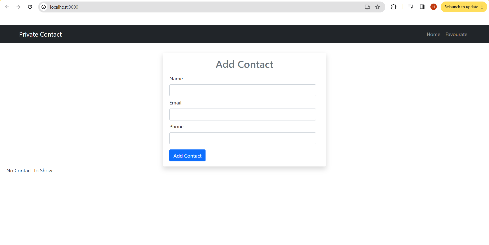
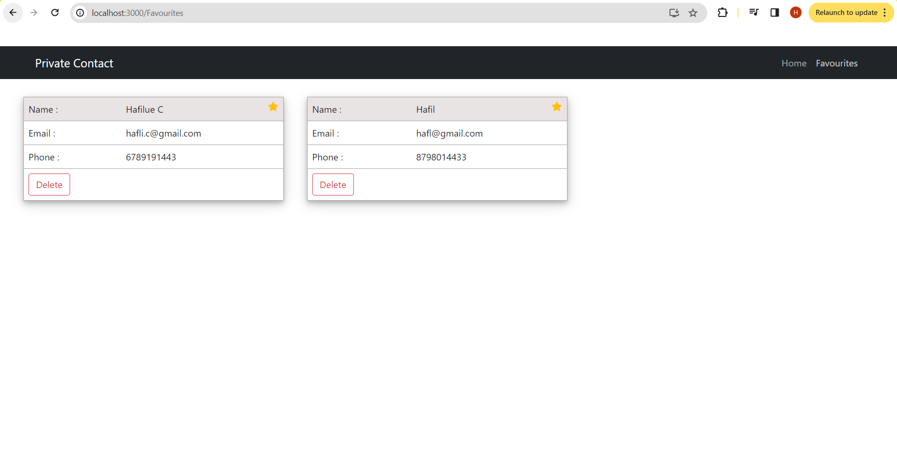

# Contact Book Web Application

## Overview
The Contact Book is a web application built using React. It allows users to manage their contacts with features such as adding contacts, validation for contact information, marking contacts as favorites, and deleting saved contacts.

## Features
- User-friendly interface for managing contact details.
- Add new contacts with name, phone number and email.
- Contact validation for name and email and number fields.
- Mark contacts as favorites.
- View favorite contacts on a separate page.
- Delete saved contacts.
- Data storage using `json-server` for dummy server setup.

### Home Page


### Add Contacts


### Favorites


## Installation

### Prerequisites
- Node.js and npm installed
- `json-server` installed globally

1. Clone the repository:

   ```bash
   git clone https://github.com/Hafilu/Contact-Book.git

   Navigate to the project directory:
   cd contact-book
   
   Install project dependencies:
   npm install

   Start the React development server:
   npm start
   
   Start the json-server for dummy server setup (assuming db.json is your data file):
   json-server --watch db.json --port 3004


## Usage
 
1. Open your web browser and go to `http://localhost:3000` to access the Contact Book.

2. To add a new contact:
   
   - Enter the contact's name, phone number and email.
   - Click the "Add Contact" button.

4. Contacts must have a valid name, phone and email, and those fields will be validated.

5. To mark a contact as a favorite:
   - Click the star button in contact card.

6. To view favorite contacts:
   - Click the "Favorites" tab in the navigation bar.

7. To delete a contact:
   - Click the "Delete" button in contact card.

## Customization
 
You can customize the appearance and functionality of the Contact Book by modifying the React components and styles in the project. You can add features like categories, notes, or other fields for contacts.

## Data Storage
 
Contact data is stored in a `db.json` file and managed using `json-server`. You can adjust the data structure and customize the server setup as needed.


Feel free to use and modify this project for your private use.
Enjoy using your Contact Book web application!


